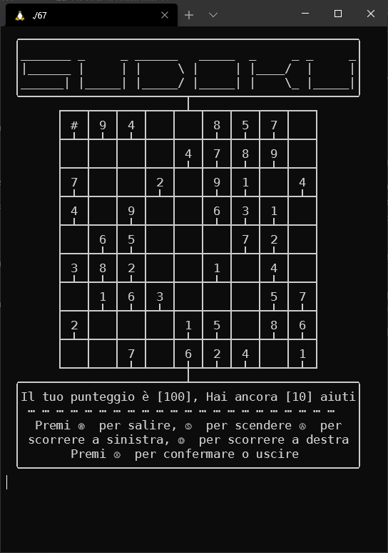

# Sudoku

  

## What's this?

A tiny text-graphics sudoku game written in C. It's a project I made when I was 15.

We had just learned about **2D arrays**, everyone had to do a simple console-based game. The graphics were made in GEdit, mostly by painfully editing the file line by line. Everything would then be converted to a single, long, literal string and placed in a `printf()` (as the `format` argument, ouch!). I tried to go for a 60s style.

At the time, I wasn't even close to be able to grasp a sudoku solving algorithm, so, I decided to work with solved tables and remove random numbers.
That approach skewed a bit the purpose of the game, as it doesn't often generate meaningful (or challenging) puzzles.

The code features aggressive `for` usage, variable recycling, and interpolated temporary values (through polynomial interpolation). That means it's a really hard to read, big chunk of code.

The rules were as usual: do not use stuff we hadn't seen in class yet. That would've been cheating :).

## Features

* completely written in [Geany](https://www.geany.org/) on a Ubuntu VM
* screen still cleared with `system("clear")`, *ouch*!
* multi slot save system
* built-in editor to add new tables with validator
* first appearance of `getch()`

---

 
 

---

## Curator

* UNIX project
* CMake scripts have been added
